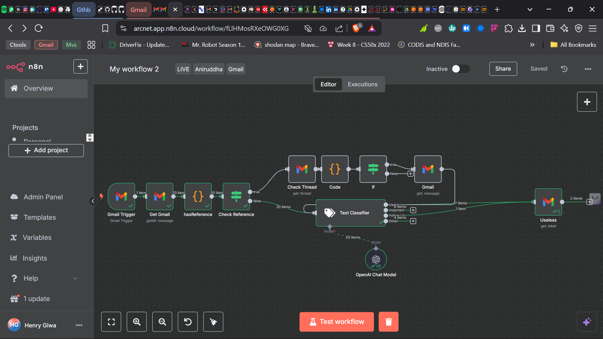
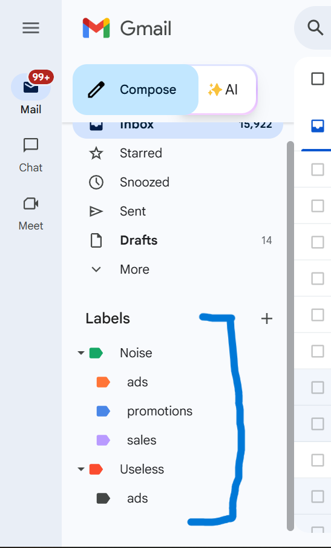

# Email Noise Filter 🤖🧹

An open-source AI automation agent that scans your inbox and **automatically labels useless emails** — helping you focus only on what truly matters.  

Built using **n8n** and **GPT-4o**, this agent runs continuously to clean up promotional clutter, sales spam, and redundant confirmations — with **zero false positives on genuine, human-written messages**.

---

## 🔧 What It Does

- 📥 **Monitors your Gmail inbox** for every new incoming email  
- 🧠 **Uses GPT-4o** to analyze the subject and body of each message  
- 🏷️ **Applies a "Noise" label** to emails classified as useless (see categories below)  
- ⛔ **Avoids false positives** using a strict exclusion rule for authentic messages  
- 🔁 **Runs passively in the background** with near real-time execution

---

## 🧠 Classification Logic

The agent marks an email as **"useless"** if it fits one of the following categories:

1. **Meeting Acceptance**  
   - Confirmations like “See you at 3pm” or “Meeting confirmed.”  
   - ✅ *Excludes invites or rescheduling (these are kept).*

2. **Sales**  
   - Cold outreach, demo requests, pricing proposals, or upsells.

3. **Marketing**  
   - Product updates, newsletters, campaigns, feature releases, and announcements.

4. **Advertisement**  
   - Sponsored content, third-party ads, or affiliate offers.

5. **Promotion**  
   - Discounts, deals, limited-time offers, coupons, or sales campaigns.

> **🚫 Important Exclusion Rule:**  
> Do NOT classify a message as “useless” if it's a genuine, human-written email — like job-related inquiries, support requests, personal introductions, or collaborative messages. These stay untouched.

---

## 🛠 Tech Stack

| Tool             | Purpose                                                           |
|------------------|--------------------------------------------------------------------|
| **n8n**          | Visual automation to coordinate Gmail + GPT-4o steps               |
| **OpenAI GPT-4o**| Large Language Model used to classify email context                |
| **Gmail API**    | Triggers on new messages and applies classification labels         |

---

## 🧩 Workflow Architecture

**Gmail (new message)** → **n8n** → **Extract subject + content** → **GPT-4o** → **Label as "Noise" or ignore** → **Gmail**

Each email is parsed and passed through GPT-4o, where it’s classified based on the logic above. If marked “useless,” it gets tagged in Gmail for easy filtering or archiving.

---

## 📦 Installation & Usage

### 1. Requirements

- Running **n8n** instance (local or cloud-hosted)
- API credentials for:
  - OpenAI (GPT-4o access)
  - Google Cloud (OAuth for Gmail API)

### 2. Import Workflow

1. Download the `agent-workflow.json` file from this repo  
2. Log into your n8n dashboard  
3. Click the **Import** icon on the top bar  
4. Upload the JSON to load the pre-built workflow

### 3. Customize

- Add your **OpenAI API key** and **Gmail OAuth credentials**  
- Modify Gmail label names (e.g., `Noise`, `Filtered`)  
- Tweak the GPT-4o classification prompt if needed  
- (Optional) Add logic to archive or auto-delete certain "Noise" labels

---

## 🔐 Security Considerations

- Uses OAuth 2.0 for Gmail API access  
- No email content is stored or logged by default  
- Only GPT-4o sees the email content for classification  
- False positives are rare due to strict filtering logic and exclusions

---

## 📸 Screenshots

### 🔄 Workflow Overview  


### 📂 Suggested Gmail Labels to Add

Organize your inbox more efficiently by applying these labels to emails processed by the **Email Noise Filter Agent**:

| **Label Name**                 | **Purpose**                                                                 |
|-------------------------------|------------------------------------------------------------------------------|
| `Noise`                       | Main label for all emails flagged as “useless” by the agent                  |
| `Noise/Sales`                 | Sales pitches, cold outreach, demo requests, upsells                         |
| `Noise/Marketing`             | Newsletters, product announcements, brand awareness campaigns                |
| `Noise/Promotions`            | Discount offers, coupons, affiliate links, limited-time deals                |
| `Noise/Ads`                   | Sponsored content, advertisements, third-party promotions                    |
| `Noise/Meeting Confirmations` | Meeting acceptance or acknowledgment messages (e.g., “See you at 3pm”)       |
| `Noise/Human Review`          | Emails flagged as borderline or unclear — for manual double-checking         |
| `Noise/Auto-Cleaned`          | Optional label for auto-archived or filtered messages                        |

---

### 🏷️ Gmail Label Tips

- Use **nested labels** for clarity and hierarchy:
  ```
  Noise/
    ├── Sales
    ├── Marketing
    ├── Promotions
    ├── Ads
    ├── Meeting Confirmations
    ├── Human Review
    └── Auto-Cleaned
  ```

- **Color-code** labels in Gmail for better visual distinction.



- You can apply Gmail filters to:
  - Automatically assign labels to incoming messages
  - Archive emails that match certain label conditions (e.g., skip inbox for `Noise/Ads`)


---

## 🧠 Why This Matters

Your inbox is full of distractions — automated reminders, cold sales pitches, endless newsletters. This AI-powered agent cuts through that clutter and **protects your focus** by labeling what doesn't need your attention — without missing anything important.

---

## 📬 Questions or Contributions?

Fork this repo, open an issue, or suggest improvements.  
Contact: **henrywilder000@gmail.com**

---

## 📄 License

Open-source under [MIT License](LICENSE).  
Use freely. Modify responsibly. Inbox peacefully.
